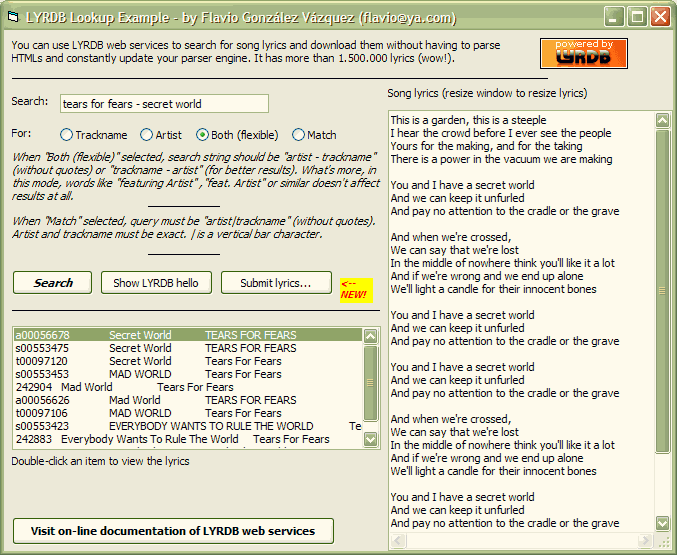



## LYRDB class \(update \#1\) \- Retrieve song lyrics automatically with LYRDB web services

### Description

[Update #1 - possibility to upload lyrics to the database!] 

----

Lyrdb Lookup is a sample project using clsLyrdb, a VB6 class encapsulating all LYRDB functionality to retrieve lyrics automatically without having to parse full HTML pages of content. I've recently created LYRDB.com, a different lyrics portal: it has over 1.500.000 lyrics (wow!) and it offers free web services to access this huge resource of lyrics programatically.

For this purpose, I have created a self-contained class that connects via Internet to LYRDB (with proxy support) and allows you to search for lyrics programatically with simple calls. Then, you can iterate over the results to show them and you can retrieve all the lyrics you want, passing a lyrics identifier (provided along with search results).

The class is very easy to use and does not have any dependence. This project is an example of how to use this class.

Please vote for this project and send feedback! If you think I could improve both the class and the web services, please comment it or mail to me (flavio@ya.com)!
 
### More Info
 

             |
---                |---
**Submitted On**   |2006-09-23 22:23:04
**By**             |[Flavio Gonzalez Vazquez](https://github.com/Planet-Source-Code/PSCIndex/blob/master/ByAuthor/flavio-gonzalez-vazquez.md)
**Level**          |Beginner
**User Rating**    |5.0 (35 globes from 7 users)
**Compatibility**  |VB 5\.0, VB 6\.0
**Category**       |[Internet/ HTML](https://github.com/Planet-Source-Code/PSCIndex/blob/master/ByCategory/internet-html__1-34.md)
**World**          |[Visual Basic](https://github.com/Planet-Source-Code/PSCIndex/blob/master/ByWorld/visual-basic.md)
**Archive File**   |[LYRDB\_clas2021649242006\.zip](https://github.com/Planet-Source-Code/flavio-gonzalez-vazquez-lyrdb-class-update-1-retrieve-song-lyrics-automatically-with-lyrdb__1-66569/archive/master.zip)

### API Declarations

(see class code)

